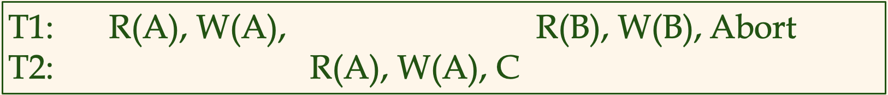
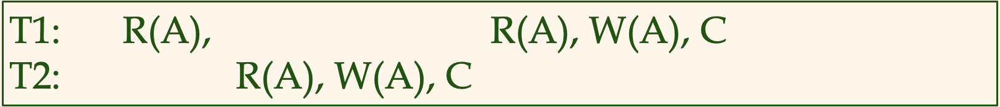
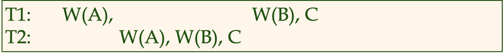

# Transaction Management 개요 

Concurrent execution of user programs is essential for good DMBS performance.
- 좋은 DBMS 성능을 위해서는 트랜잭션(사용자 프로그램)의 동시 실행이 필수적이다.
- 따라서 DBMS는 여러 트랜잭션들을 인터리빙해가며 처리한다. (실제로 프로세스가 병렬로 처리하는 것이 아닌 각 트랜잭션들을 switch 해가며 동시에 처리)

ex) 구매 프로그램, 예약 프로그램 등 

- DB를 사용하는 사용자 프로그램(트랜잭션)에서, 디스크 접근(I/O)는 자주 일어난다. 
- 그러나 디스크 접근은 실제 CPU에서 일어나는 연산 처리 속도보다 느리다. 
- 따라서 CPU Humming(keep busy)를 위해서는 이러한 트랜잭션들이 동시에 일어나는 것이 효율적이다.

사용자 프로그램들은 데이터베이스로부터 데이터를 가져와서, 그 데이터를 이용해 비지니스에 필요한 여러 로직들을 처리한다.
> 그러나 DBMS 입장에서 봤을 때 사용자 프로그램에서 일어나는 CPU 연산은 중요한 것이 아니다. 
> 
> DBMS에 입장에서는 disk i/o (사용자 프로그램이 데이터베이스에 read / write 하는 연산)이 중요하다. 


트랜잭션 관리에서는 크게 두 가지가 중요한 이슈이다.
1. 여러 트랜잭션들이 동시에 수행되는 데 이 때 동시성 제어를 어떻게 할 것인가?
2. 트랜잭션이 실행 중 시스템의 장애가 발생하면 어떻게 데이터베이스를 다시 일관된 상태로 유지시킬 것인가?

이를 이야기 하기 전에 먼저 트랜잭션이란 무엇이고 어떠한 성질을 가지고 있는지에 대해 정의하고 넘어가겠다.

---

### 데이터베이스 Transactions 

먼저 트랜잭션이란 무엇일까? 위키피디아에서는 데이터베이스에서의 트랜잭션을 다음과 같이 정의한다.
> 데이터베이스의 상태를 변환시키는 하나의 논리적 기능을 수행하기 위한 작업의 단위 


참고한 서적에서는 트랜잭션에 대하여 DBMS의 입장에서 다음과 같이 정의한다.
> DBMS's abstract view of user program (a sequence of reads and writes)

> 트랜잭션은 DBMS가 보는 변경의 기본 단위이다. 
---

### 트랜잭션의 ACID 성질 
```
1. Atomicity (원자성) 
   - 트랜잭션에 속하는 모든 i/o actions은 마치 하나의 원자처럼 더 이상 쪼갤 수 없어야한다. 
   - 즉 하나의 트랜잭션이 성공적으로 끝나는 경우, 데이터베이스의 상태는 트랜잭션에 속하는 모든 I/O action들이 반영된 상태여야하며, 
     실패하는 경우, 데이터베이스의 상태는 트랜잭션에 속하는 모든 I/O action들이 실행되지 않은, 마치 트랜잭션 이전의 상태로 남아야한다.
     (All or Nothing)
     
2. Consistency (일관성)
   - 다른 트랜잭션들과 동시에 수행되지 않는 각 트랜잭션은 데이터베이스의 일관성을 유지해야한다. (그러나 일관성은 데이터베이스를 사용하는 유저의 책임이다.)
   
3. Isolation (고립성)
   - 각 트랜잭션은 동시에 스케쥴된 다른 트랜잭션의 영향으로부터 고립되거나 보호되어야한다.
   
4. Durability(영속성) : 트랜잭션이 성공적으로 완료하였다는 것을 사용자에게 통보하자마자, 
                       그 트랜잭션의 효과가 디스크에 반영되기 전에 시스템에 장애가 발생한다 하더라도, 지속적으로 남아있어야한다. 
```

---
### Scheduling Transactions

Seiral Schedule (직렬 스케쥴) : 여러 트랜잭션에 속하는 I/O action들이 시작부터 끝까지 각 트랜잭션의 순서대로 순차적으로 실행되는 스케쥴 
> 장점 : 실행순서가 보장되므로 결과에 항상 이상이 없다. 
> 
> 단점 : 현실적으로 여러 트랜잭션들이 interleave하며 수행되기 때문에 이러한 스케쥴이 항상 나오기는 어렵다. 

Serializable Schedule(직렬화 스케쥴) : 각 트랜잭션의 I/O action들이 서로 다른 트랜잭션끼리 interleave되며, 순차적으로 처리되지 않아도, 마치 그 결과는 직렬 스케쥴과 동일하게 유지되는 방식

> 실행순서가 보장되지 않으므로 이를 보완하기 위한 여러 테크닉이 필요하다.
---
### 인터리브된 실행에 의해 발생될 수 있는 이상 현상


**Dirty Read** : 실제 데이터 베이스에서 Dirty Read는, 커밋되지 않은 트랜잭션에 의해 수정된 데이터를 읽어오는 것을 허용할 때 발생하는 문제이다.

```
1. 첫 번째 트랜잭션에서 데이터 A를 변경함
2. 두 번째 트랜잭션에서는 (1)에서 수정된 데이터 A를 읽어 로직을 처리하여 다시 데이터 A를 저장하고 commit 한 경우
3. 첫 번쨰 트랜잭션이 abort 되어 롤백됨
```

> 첫 번째 트랜잭션이 commit 되는 경우에는 두 번째 트랜잭션 또한, 정상적인 데이터를 읽은 것이므로 문제가 되지 않는다.
> 그러나 첫 번째 트랜잭션이 Roll back되는 경우, 
> 두 번째 트랜잭션은 실제로 존재하지않는(abort된) dirty data를 읽은 후 로직을 처리하는 것이므로 문제가 생길 수 있다. 

테스트 참고용 링크 : https://codingsight.com/understanding-dirty-read-problem-sql-server/

---


**Unrepeatable Reads (RW Conflicts)**

```
1. 첫 번째 트랜잭션에서 데이터 A를 조회함
2. 두 번쨰 트랜잭션에서 데이터 A를 수정하고 commit함
3. 첫 번째 트랜잭션에서 데이터 A를 조회하면 1번에서 조회한 결과값과 다르게 나옴
```

첫 번째 트랜잭션이 아직 데이터 A에 대한 어떠한 write 연산도 하지 않았다면, 데이터 A를 다시 조회하는 경우 이전과 같은 데이터가 조회되야한다.

테스트 참고용 : https://stackoverflow.com/questions/15935891/how-to-simulate-non-repeatable-read-sql-server

https://dotnettutorials.net/lesson/non-repeatable-read-concurrency-problem/

> DB단에서 2PL등을 사용해 이러한 문제를 해결하지 않으면 
> 
> 사용자 코드를 짤 때 이러한 현상이 있을 수 있으므로 버그가 나지 않도록 주의해야한다 정도로 이해하였다.

---


**Overwriting Uncommitted Data(write - write conflict)**

첫 번째 트랜잭션이 아직 commit 되지 않은 상태에서 두 번째 트랜잭션이 A에 값을 덮어쓰는 경우 
(1번 트랜잭션의 결과로 원했던 A와 실제 결과가 2번째 트랜잭션의 결과로 인해 달라지게 된다.)

---
### REF 
데이터베이스 시스템(3/E)  / Database Management Systems 3ed, R. Ramakrishnan and J.Gehrke 

5부 트랜잭션 관리 - 16 트랜잭션 관리 개요 
