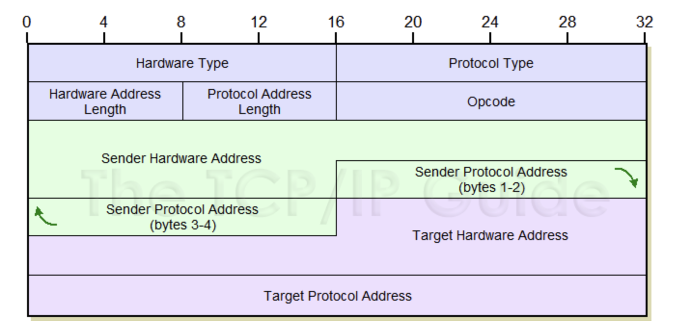

### Address Resolution Protocol 

네트워크 상에서 IP주소를 물리적 네트워크 주소로 Bind하기 위해 사용하는 프로토콜

등장배경 : byte stream 프로토콜에는 (CHAOS, DOD TCP Xreox, BSP)와 같은 많은 프로토콜이 Ethernet위에서 하나의 케이블에 서 공존한다. 이때, 이더넷은 48bit으로 이루어진 주소를 케이블에서 필요로 하지만, 위에 명시된 프로토콜 대부분의 프레임 주소는 48bit도 아니며, 프로토콜 주소가 Ethernet주소와 관계를 가질 필요도 없으나, 대부분의 프로토콜은 <프로토콜, 프로토콜 주소>와 Ethernet주소를 다른 호스트로 전달해야한다. 

여러가지 프로토콜을 대응하기 위한 옵션 중
1. 모든 소프트웨어에서 다양항 프로토콜에 대해, 프로토콜 주소를 Ethernet주소로 변환할 수 있도록 만든다.
2. 모든 소프트웨어에서 다양한 프로토콜 주소를 Ethernet 주소로 변환할 수 있는 표준 소프트웨어를 사용한다.

2번째 방식으로 '표준'에 대한 정의를 내린 것이 Address Resolution Protocol (RFC826)에 기술되어있다.

---
### ARP 패킷 구조 정의

 - Hardware address space(Hardware Type) : 하드웨어 주소 (16bit) (이더넷 통신 시 항상 1로 설정된다.)
 - Protocol address space(Protocol Type) : 프로토콜 주소 (16bit) (맵핑 대상의 프로토콜 IPv4의 경우 0x0800)
 - Hardware address Length : 하드웨어 주소의 길이(해당 필드에 byte 단위로 기록) 8bit (이더넷 통신시 6로 설정된다.)
 - Protocol address Length : 프로토콜 주소의 길이(해당 필드에 byte 단위로 기록) 8bit (IPv4의 경우 4로 설정된다.)
 - OP Code : REQUEST인지, REPLY인지를 나타냄 (1: ARP Request, 2: ARP Reply, 3: RARP Request, 4. RARP Reply)
 - sender에 대한 정보 (송신자의 하드웨어 주소, 프로토콜) (인터넷 통신상에서로 한정하면 송신자의 MAC 주소, IP주소)
 - target에 대한 정보 (수신자의 하드웨어 주소, 프로토콜) (인터넷 통신상에서로 한정하면 수신자의 MAC 주소, IP주소)
    (ARP Request인 경우 target(destination)의 하드웨어 주소는 0으로 설정된다. 단 이더넷 프레임에서 목적지 주소가 ff:ff:ff ...로 브로드캐스팅된다) 
    
---
### ARP Request Packet 생성 과정

패킷을 전달하기 위해 Routing Table을 통해 next hop의 IP주소를 찾는다.

ARP 모듈에서 관리하는 ARP 테이블에서 <프로토콜, 타겟의 프로토콜 주소> 쌍에 해당하는 entry가 존재하는지 찾는다. 
- (ip, ip주소에 대응되는 mac주소가 ARP 테이블에 존재하는지 체크)

ARP 테이블에서 Entry를 찾았다면, Caller에게 next hop의 48.bit Ethernet address(MAC 주소)를 전달한다.

(이후 패킷은 next hop으로 전달되게 된다)

만약에 엔트리를 찾지 못했다면, 현재 전달하고자하는 패킷을 버림을 송신자에게 알리고 (상위 네트워크 계층에서 다시 해당 패킷을 재전송 요청 할 것을 가정함) 이더넷 패킷을 생성한다. 

생성되는 ARP Request 패킷

이더넷 프레임의 헤더의 destination 주소를 ff:ff:ff ...로 설정하여 해당 LAN에 브로드캐스팅

이더넷 패킷 헤더의 type은  Address_resolution을 나타내는 값(0806)로 설정

ARP 패킷의 Hardware address space를 이더넷으로 설정

ARP 패킷의 Protocol address space를 자신이 변환시키고자하는 프로토콜 주소의 타입으로 설정

ARP 패킷의 Hardware address Length를 6으로 설정(이더넷인 경우)

ARP 패킷의 Protocol address Length를 변환하고자하는 프로토콜 주소의 길이로 설정(IPv4의 경우 4)

ARP 패킷의 Op code를 1로 설정 (ARP Request)

Sender의 이더넷주소, 프로토콜 주소 입력

target의 프로토콜 주소 입력 (이더넷 주소는 따로 입력하지 않는다.)

---

#### 참고자료

[REF : 오리뎅이님 블로그](https://blog.naver.com/PostView.naver?blogId=goduck2&logNo=220138802591&parentCategoryNo=&categoryNo=73&viewDate=&isShowPopularPosts=false&from=postView)

[RFC 826](https://datatracker.ietf.org/doc/html/rfc826)

[RFC 826 번역](https://www.getoutsidedoor.com/2020/09/26/rfc-826-%EC%A0%95%EB%A6%AC-address-resolution-protocol-arp/)

[이더넷](https://github.com/khs960616/TIL/blob/main/network/%EC%9D%B4%EB%8D%94%EB%84%B7(L2).md)
