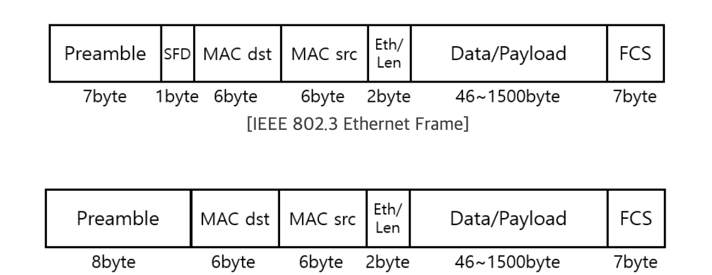

# 이더넷(Eternet)
- 컴퓨터 네트워크를 위한 LAN, WAN에서 가장 많이 활용되는 기술 규격 
- OSI 7계층에서 Phyiscal Layer에서의 신호와 배선, Data Link Layer에서의 MAC패킷과 프로토콜 형식을 정의한다.

이더넷 프레임 : 다음의 6개의 필드로 구성되어있다. (Preamble, SFD를 Physical Layer Header라고 생각하면 된다)





(Preamble, SFD), Destination Address, Source Address, Length or Type, Dataand padding, CRC

(Preamble, SFD)는 Physical Layer에서 더해지는 필드이다. 

---

Preamble(서문) : 10101010이 반복되는 7byte의 필드

SFD(Start Frame Delimeter) :10101011 로 이루어진 1byte의 필드, 마지막 두비트 11은 수신자에게, 다음에 오는 필드가 Desitanation Address 임을 알린다.

Preamble + SFD -> 다음의 8바이트의 신호를 이용해 프레임 전송의 시작이 있음이 알리며, 수신자와 클럭의 동기화를 맞추는데 사용한다.  (수신자측에서 0과 1을 구분할 수 있도록)
```
so the preamble is used to synchronize a receive clock before data is transmitted.
```

---
Destination Address, Source Address : 6바이트로 이루어진 목적지와 발신지의 MAC 주소 

---
Type(Length) : 해당 패킷이 상위 계층의 (IP, ICMP, ARP) 어디로 가는지 알리거나, 데이터 필드에 있는 바이트의 길이를 알리는데 사용된다.
- Type의 대표적인 값들 (0x600 이상의 값 만이 가능함)

16진수 4bit

• 0800 : IP
• 86DD : IPv6

• 8191 : NetBIOS
• 0600 : Xerox XNS IDP
• 0805 : X.25

• 0806 : ARP
• 0835 : RARP

• 6003 : DEC DECnet Phase Ⅳ
• 8137 : Novell Netware IPX
• 8847 : MPLS
• 8863 : PPPoE Discovery Stage
• 8864 : PPPoE PPP Session Stage

---
Data : 상위 계층 프로토콜로부터 전달 받는 캡슐화 된 데이터, 최소 46바이트 ~ 최대 1500 바이트

* 최소길이가 존재하는 비유? (CSMA/CD) 동작에 필요한 최소 길이를 만족시키기 위함
* CSMA/CD 란 ? 이더넷 환경에서 데이터 전송 전, 네트워크 통신이 있는지 체크하기 위한 방식 (
* 최대 제한 길이가 있었던 이유? -> 

1. 이더넷을 설계한 당시 메모리가 너무 비싸서 버퍼의 길이를 줄이기 위해,  

2. 최대 길이 제한을 둠으로써 공유 매체를 혼자 독점하는 것을 막을 수 있다.

[REF](https://www.quora.com/Why-does-ethernet-have-a-minimum-and-maximum-frame-length)

---
CRC : 오류 검출에 필요한 정보를 포함한다. 
